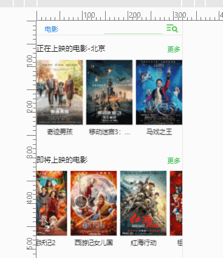

# douban_movie

简易豆瓣电影项目

> vue2.0+webpack+sass+CSS Module+hotcss

[2018.12.16] 部署到服务器，采用nginx代理豆瓣api，预览地址：http://120.78.167.54/#/

## 图片演示



## 本地演示

```
git clone git@github.com:wungjyan/douban_movie.git

npm install

npm start
```

## 介绍

### 功能

正在上映的电影 （查看更多）  
即将上映的电影 （查看更多）  
电影详情页  
电影（人物）搜索上拉加载

### 项目特点

* 组件化
* 自适应
* CSS Module

### 组件化

利用 vue 组件化，将部分功能拆分成组件。比如首页的电影滑动展示，是一个组件（moviesList），此组件里又引入了轮播组件（slider）。若需添加展示的电影类目，只需传入对应的请求 api：

```
 <movies-list requestUrl="/api/movie/coming_soon"></movies-list>
 //此处传入的是“即将上映的电影”的api，默认请求的是“正在热映的电影”
```

### 自适应

移动端自适应使用了[hotcss.js](https://github.com/imochen/hotcss)和[px2rem-loader](https://github.com/Jinjiang/px2rem-loader)。
hotcss 使用动态的 HTML 根字体大小和动态的 viewport scale。在 vue 中配置 px2rem-loader，在开发时只使用 px，px2rem 把 px 转成 rem，再动态的计算 font-size。

### CSS Module

使用 css Module 防止命名冲突，它的工作原理是把一个类名编译成哈希字符串，然后在引用的时候直接使用这个哈希字符串字符串，进而保证相同的类名根据不同的路径和组件名称得到不同的值，保证了最终的类名隔离。
[vue 中配置 CSS Module](https://vue-loader.vuejs.org/zh-cn/features/css-modules.html)

### API 请求

项目中用到的 api 有：

* 正在上映的电影（北京）：/v2/movie/in_theaters
* 即将上映的电影：/v2/movie/coming_soon
* 电影搜索：/v2/movie/search?q=

[查看更多豆瓣 api](https://developers.douban.com/wiki/?title=api_v2)

### 插件

[vue-infinite-scroll](https://github.com/ElemeFE/vue-infinite-scroll) 上拉加载
[vue-awesome-swiper](https://github.com/surmon-china/vue-awesome-swiper) vue 轮播插件

## webpack

考虑到此项目不是很复杂以及为了便于配置，所以自己配置了`webpack.config.js`文件。  
由于自己不是很熟悉 webpack，所以过程中遇到不少错误，好在参考 webpack 官方文档以及 vue 官网后都能找到解决方法。  
项目目录里有两份配置文件：

```
//基础配置，只用于开发环境
webpack.config.js

//添加不同环境，用于打包
webpack.config.dev.js
```

此项目如果打包上线，由于跨域问题，功能会失效。不过为了练习，所以还是配置了 `webpack.config.dev.js` 文件。  
若需打包，在 scripts 中指定配置文件：

```
"build": "webpack --env.production --config webpack.config.dev.js"
```

### 遇到的问题

一些关于 loader 和插件之类的问题，参考官网就可以找到解决办法，就不详说了。这里想要提一个重要的问题，如果是第一次配置 vue 项目的 webpack 文件，你可能会在浏览器中看到这样的错误：

> [Vue warn]: You are using the runtime-only build of Vue where the template compiler is not available. Either pre-compile the templates into render functions, or use the compiler-included build.

出现这个的原因是缺少 vue 编译器。具体请参考官网这里[对不同构建版本的解释](https://cn.vuejs.org/v2/guide/installation.html)。

解决方法：在 webpack 配置文件里加入这一项

```
resolve: {
  alias: {
    vue$: 'vue/dist/vue.esm.js' // 用 webpack 1 时需用 'vue/dist/vue.common.js'
  }
},
```

## 总结

不通过 vue 脚手架，从零到整地手打所有代码，让我加深了对 vue 开发的理解以及了解了 webpack 的配置使用。项目中使用到了 CSS Module 命名以及 hotcss 适配方案，让我在收获新知识的同时，也打下了延伸其他项目的基础。通过不断学习和总结，提升自身能力。

## 反思
【2018.12.16】现在来看，我只做到了功能，但体验并不太好，页面加载时空白页，可加入loading，上拉加载没提示，样式不太好看，这些问题其实开发时就明白了，但那时我真的只追求功能，对这些没太在意，时间长了，不想再碰了 →_→   
现在觉得能力的提高可能并不是写过多少东西，而是不断地改旧代码，那么促使自己改旧代码的前提应该就是一开始就要精益求精 →_→